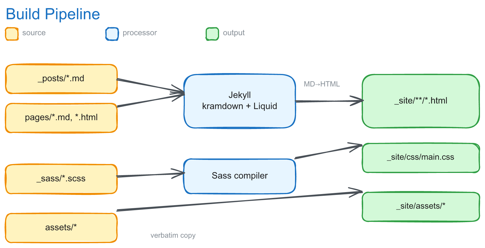

# 기술 문서 — 내부 구조와 아키텍처

블로그가 어떻게 빌드되고 맞물려 돌아가는지를 설명하는 문서다. 글을 읽는 독자가 아니라
**템플릿을 고치거나 빌드를 디버깅하는 사람**을 위한 것이다. 렌더링 파이프라인,
URL과 내비게이션을 결정하는 분류 체계, 수식 처리(와 그 함정), 검색, 스타일, 배포 순으로 다룬다.

처음 읽는다면 §1(기술 스택)으로 큰 그림을 잡고, 무언가 고장 났다면 §8(함정 모음)부터 보면 빠르다.
설치와 글 작성 방법은 [README.ko.md](../README.ko.md)에 있다.

---

## 1. 기술 스택

| 영역 | 선택 |
|------|------|
| 정적 사이트 생성기 | Jekyll 4.4 (`Gemfile`, Ruby 3.3+), kramdown (GFM 입력) |
| 플러그인 (gem) | `jekyll-paginate`, `jekyll-sitemap`, `jekyll-feed` |
| 로컬 플러그인 (`_plugins/`) | `reading_time.rb`(한·영 읽기시간), `lazy_images.rb`(`` lazy-load) |
| 신택스 하이라이팅 | Rouge (서버사이드, kramdown 내장); 테마는 `_sass/_syntax.scss` |
| 수식 | kramdown `math_engine: mathjax` → MathJax 3, 포스트별 `use_math`로 로드 |
| 스타일 | Sass (`_sass/`), 벤더링된 Bourbon + Neat 그리드 프레임워크. `jekyll-sass-converter` 2.x(libsass) 고정 — 3.x의 dart-sass는 Bourbon/Neat의 구식 `/` 나눗셈에서 에러 |
| 자바스크립트 | 바닐라 JS (`js/main.js`, jQuery 없음). 이미지 확대 GLightbox, 툴팁 Tippy.js. 외부 CDN은 SRI(`integrity`)로 검증 |
| 검색 | 생성된 `search.json`(전체 본문 색인) 위 `simple-jekyll-search` |
| 다크모드 | 라이트가 기본, 토글로 opt-in (`_sass/_dark.scss`, `[data-theme="dark"]`). OS 설정은 따르지 않음 |
| 호스팅/CI | GitHub Actions를 통한 GitHub Pages (`.github/workflows/jekyll.yml`) |

## 2. 빌드 파이프라인

1. **프런트매터** — 각 포스트의 YAML(`categories`, `date`, `title` 등)이 출력 경로와 템플릿 변수를 모두 결정한다.
2. **마크다운 → HTML** — GFM 입력의 kramdown. Rouge가 펜스 코드 블록을 토큰화한다.
3. **Liquid** — `_layouts/default.html`이 모든 페이지를 감싼다(`head` + `header` + 본문 + `footer`). `post`, `page`, `archive`가 이를 확장한다.
4. **출력** — `_site/` 아래 `<category>/<subcategory>/YYYY/MM/DD/<slug>.html` 경로로 기록된다(§3 참조).

`_site/`는 git에서 제외된다. 로컬의 `_posts/_site/`, `.sass-cache/`, `.jekyll-cache/`는 스테일 빌드 산출물로 역시 무시되며 삭제해도 안전하다.

## 3. 분류 체계 → URL과 내비게이션

포스트는 **2단계** 카테고리를 가진다: `categories: ["<유형>", "<주제>"]`.

- **0단계 (유형)** — `Paper Reviews`, `Paper Summaries`, `Tech Guides`, `Insights`. 각각 전용 페이지/탭을 가진다.
- **1단계 (주제)** — `Language-Models`, `Multimodal-Learning`, `Finetuning`, `Retrieval-Augmented-Generation`, `Agentic-AI` 등(자유롭게 확장).

이 둘과 날짜가 합쳐져 출력 경로가 된다:

내비게이션은 데이터 기반이다. `_includes/nav_links.html`이 `main_nav: true`인 모든 페이지를 `nav_order` 순으로 렌더링한다. 현재 순서:

| nav_order | 페이지 | 소스 |
|-----------|--------|------|
| 1 | About | `about.md` |
| 2 | Paper Summaries | `paper-summaries.md` — `site.categories['Paper Summaries']` 필터 |
| 3 | Paper Reviews | `paper-reviews.md` — `site.categories['Paper Reviews']` 필터, 주제별 그룹화 |
| 4 | Tech Guides | `tech-guides.md` — `site.categories['Tech Guides']` 필터 |
| 5 | Insights | `insights.md` — `site.categories['Insights']` 필터 |
| 6 | Search | `search.md` |

`categories.html`(`/categories/`)과 `tags.html`(`/tags/`)은 *모든* 카테고리/태그를 가로지르는 전체 색인이며, 메인 내비가 아니라 포스트 메타데이터에서 링크된다.

> **누수 주의.** *모든* `site.categories`를 순회하는 페이지는, 다른 유형의 포스트가 1단계 주제를 공유할 때 그 포스트까지 끌어온다(예: `Agentic-AI` 태그가 붙은 `Insights` 글이 Paper Reviews에 노출). 유형 페이지들은 `site.categories['<유형>']`을 먼저 필터링한 뒤 그룹화하는 방식으로 이를 막는다 — 절대 그 반대로 하지 않는다.
>
> 또한 메타데이터 앵커 링크(카테고리/태그)는 `slugify`로 통일했다. 과거에는 `downcase`(공백 유지)와 H2 id(`Paper Reviews`, 원본 케이스)가 어긋나 앵커 점프가 깨졌다(html-proofer가 128건 적발).

## 4. 수식 렌더링

**수식은 항상 `$$...$$`로 작성한다** — 인라인이든 디스플레이든. kramdown의 *유일한* 수식 구분자가 `$$`다. `$$`를 쓰면 kramdown이 내용을 그대로 보존해 `\(...\)`(인라인) 또는 `\[...\]`(디스플레이)로 내보내고, MathJax 3(`_includes/head.html`에 설정)가 브라우저에서 렌더링한다.

### 단일 `$`가 깨지는 이유

kramdown은 단일 `$`를 수식으로 취급하지 **않는다** — `$x_i + y_j$`는 그냥 일반 텍스트다. GFM 강조 문법이 먼저 실행되므로, 구간 *안*의 짝지어진 `_`…`_`나 `*`…`*`가 `<em>`/`<strong>`으로 변해 MathJax에 깨진 입력이 전달된다(위 그림 빨강 경로).

과거 우회책은 모든 언더스코어를 `\_`로 손수 이스케이프하는 것이었다. 근본 해결은 `$$`를 쓰는 것 — 구간 안의 마크다운 처리를 완전히 끈다. 저장소는 일괄 마이그레이션되었다(git 히스토리 참조). 코드 블록 안의 단일 `$` 수식(예: DeepSeek-R1의 `<think>` 트레이스)은 verbatim 코드로 그대로 표시되므로 무관하다.

> **통화 표기 주의.** 본문의 달러 기호(`$1.2B`, `$250M`)는 수식이 아니므로 단일 `$`로 둬야 한다. MathJax 설정에서 `$`는 인라인 구분자에서 **제거**했다(`\(...\)`만 사용) — 그러지 않으면 한 줄에 통화 `$`가 둘 있을 때 MathJax가 그 사이를 수식으로 잘못 렌더링한다. `processEscapes: true`로 `\$`는 달러 기호로 출력된다.

MathJax 설정은 `head.html`에 있으며 ``로 감싸 **수식이 있는 포스트에서만** 로드한다. 그래서 산문 전용 글과 일반 페이지는 약 1 MB짜리 MathJax 스크립트를 아예 받지 않는다.

## 5. 검색

- `search.json`은 Liquid 템플릿(`layout: null`)으로, 각 포스트를 `{title, url, date, category, tags, snippet, content}`로 내보낸다. `snippet`은 결과 카드에 보여줄 40단어 발췌이고, `content`는 매칭용 **전체 본문**(HTML 제거)이다.
- **왜 전체 본문인가** — `simple-jekyll-search`는 부분문자열 매칭이라 색인에 없는 단어는 못 찾는다. snippet만 색인했을 때 `어텐션`·`트랜스포머`가 본문엔 18개 포스트에 있는데 발췌(앞 40단어)엔 없어 **0건**이 나왔다. `content`로 전체를 색인해 한글 재현율을 회복했다. 파일은 약 2.7 MB지만 gzip 후 ~786 KB이며 `/search/`에서만 로드된다.
- `js/search.js`가 `simple-jekyll-search`(CDN 버전 **고정 + SRI**: `1.10.0`)를 `search.md`의 `#search-input`에 연결한다. 키워드를 `<mark>`로 강조하고 매칭 개수를 라이브 상태줄에 표시하며, 강조는 렌더 후 **디바운스**로 한 번만 실행한다(과거엔 키 입력마다 `setTimeout`을 쌓아 자기 자신과 경합했다).
- `category`/`tags`도 색인되므로 제목·본문뿐 아니라 메타로도 검색된다. `_config.yml`의 `simple_jekyll_search.exclude`가 About/Search/index를 결과에서 제외한다.

## 6. 스타일

`css/main.scss`가 Sass 진입점이며 다음 순서로 임포트한다: Bourbon → `base/` → Neat → `_layout` → `_post` → `_tags` → `_syntax`(Rouge 코드 테마) → `_dark`(다크모드 오버라이드, 마지막에 로드해 캐스케이드 우선).

- **수정 대상**: `_sass/_layout.scss`, `_sass/_post.scss`, `_sass/_tags.scss`, `_sass/base/*`(특히 색상·간격·브레이크포인트를 담은 `_variables.scss`).
- **수정 금지**: `_sass/bourbon/**`, `_sass/neat/**`(벤더 프레임워크), `_sass/_syntax.scss`(생성물 — `rougify style monokai.sublime`로 재생성).
- **디자인 토큰 사용**: 전환은 `$transition-*`, 그림자는 `$shadow-*`, 강조/메타 텍스트는 `$action-color`/`$medium-gray`를 쓰고 `0.3s ease`나 hex를 하드코딩하지 않는다. `$medium-gray`는 `#767676`(흰 배경에서 WCAG AA), `$highlight-color`는 흰 텍스트가 읽히는 진한 파랑(헤더/푸터 배경).
- **절대 금지**: 인라인 HTML `<style>` 블록에 SCSS 변수를 넣지 말 것. Jekyll은 거기서 Sass를 실행하지 않아 `$base-spacing` 등이 리터럴 깨진 CSS로 나간다(원래 `tags.html` 버그였고, 지금은 `_sass/_tags.scss`로 옮겼다).

접근성 기준(`_layout.scss`): 상호작용 요소에 `:focus-visible` 아웃라인, 테마의 호버 transform을 무력화하는 `prefers-reduced-motion` 블록. 모바일 메뉴 버튼은 `aria-label`/`aria-expanded`/`aria-controls`를 갖고 JS가 `aria-expanded`를 동기화하며, 활성 내비 링크는 `aria-current="page"`를 받는다.

## 7. 배포 및 SEO

- **CI** — `.github/workflows/jekyll.yml`이 `main` 푸시 시 `JEKYLL_ENV=production`으로 빌드하고 `actions/deploy-pages`로 배포한다. 빌드 후 **html-proofer**가 내부 링크·이미지·앵커를 검증하며, 깨진 것이 있으면 배포를 막는다(외부 링크는 건너뛴다).
- **사이트맵/피드** — `jekyll-sitemap`(`/sitemap.xml`)과 `jekyll-feed`(`/feed.xml`)가 생성한다. `robots.txt`가 크롤러를 사이트맵으로 안내하고, `head.html`이 `<link rel="alternate">`로 피드를 알린다.
- **소유권 인증 토큰** — 루트의 `google*.html`, `naver*.html`은 Search Console / 네이버가 소유권을 확인하고 사이트맵을 크롤링하도록 사이트 루트에 그대로 서빙돼야 한다. 그래서 `_config.yml`의 `exclude`에 **넣지 않는다**. 다시 제외하면 검색 색인이 조용히 망가진다 — 증상은 "구글이 사이트맵을 못 읽음"이다.

## 8. 함정 모음 (디버깅 전에 읽을 것)

이 저장소를 고치다 부딪히기 쉬운, 비직관적인 지점들을 모았다.

- **다크모드에서 글자가 안 보임** — 다크 규칙은 `<html>`에 적용되는데 `_typography.scss`의 `body { color:#333 }`이 특정성이 더 높다. 그래서 다크 mixin에서 `body`·헤딩 색을 **명시하지 않으면** 어두운 배경에 어두운 글자가 된다. (§6)
- **수식이 `<em>`으로 깨짐** — 단일 `$` 안의 `_`/`*`가 MathJax보다 먼저 강조 문법으로 처리된다. `$$`를 쓴다. (§4)
- **검색이 단어를 못 찾음** — `search.json`이 발췌만 색인하면 본문 뒷부분 단어가 0건이 된다. 전체 본문(`content`)을 색인해야 한다. (§5)
- **카테고리/태그 앵커 점프 실패** — 메타 링크와 H2 `id`의 슬러그 방식이 다르면 깨진다. 양쪽 다 `slugify`로 통일한다. (§3)
- **SCSS 변수가 깨진 CSS로 출력** — 인라인 `<style>`에 `$변수`를 쓰면 Jekyll이 Sass를 안 돌려 리터럴로 나간다. `_sass/` 파셜에 쓴다. (§6)
- **Sass 빌드 실패** — `jekyll-sass-converter` 3.x(dart-sass)는 벤더링된 Bourbon/Neat의 구식 `/` 나눗셈에서 에러난다. 2.x(libsass)로 고정돼 있다. (§1)
- **검색 색인이 조용히 망가짐** — `google*.html`/`naver*.html`을 `exclude`하면 소유권 인증이 풀린다. (§7)
- **다이어그램 폰트가 일반체로 나옴** — Resvg는 Excalidraw의 woff2 `@font-face`를 못 읽는다. `assets/images/render-diagrams.sh`처럼 전체 Excalifont `.ttf`를 `fontFiles`로 넘긴다. Excalifont에 없는 글자(`→`,`✓`,`✗`)는 라벨 전체를 fallback시키므로 ASCII로 바꾼다.

## 9. 알려진 이슈 / 백로그

- **날짜 드리프트** — 대부분 포스트의 파일명 날짜가 프런트매터 `date:`(보통 원 논문 날짜)와 다르다. Jekyll은 URL/정렬에 프런트매터 날짜를 쓰므로 파일명은 외형일 뿐이다. 포스트 추가 시 일관성을 유지하라. (자동 수정 안 함: 날짜를 고치면 이미 게시된 URL이 바뀌어 인바운드 링크/SEO가 깨진다.)
- **한글 검색 라이브러리** — `simple-jekyll-search`는 형태소 분석 없는 부분문자열 매칭이라, 띄어쓰기로 분리된 한글 복합어의 부분 검색에는 한계가 있다. 전체 본문 색인으로 재현율은 확보했으나 더 정교한 검색이 필요하면 Lunr 등으로 교체를 검토한다.
- **검색 색인 크기** — 전체 본문 색인이라 `search.json`이 약 2.7 MB(gzip ~786 KB)다. `/search/`에서만 로드되지만, 글이 크게 늘면 페이지네이션·서버사이드 검색을 고려한다.
