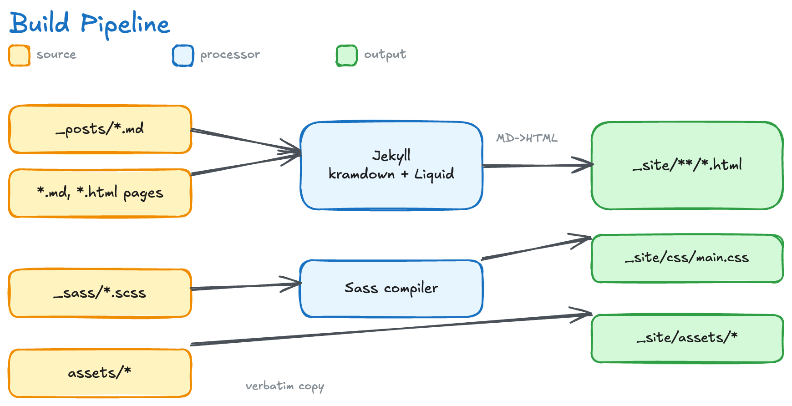
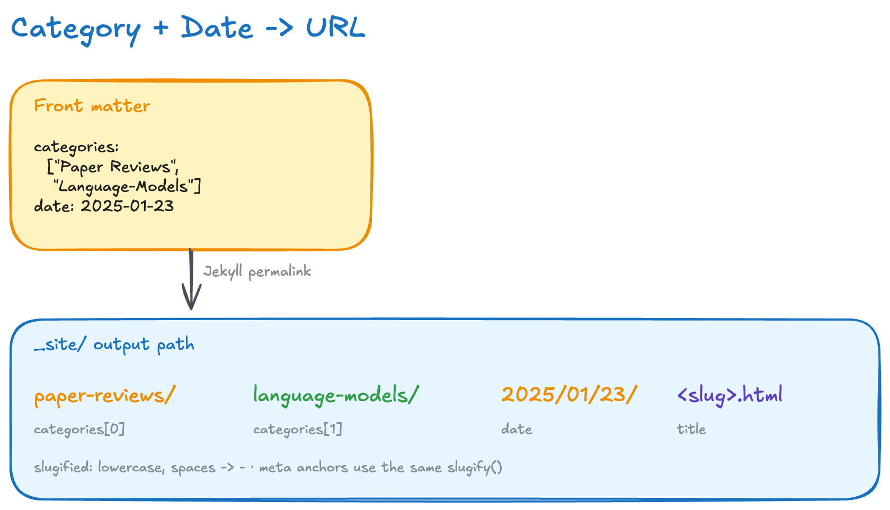
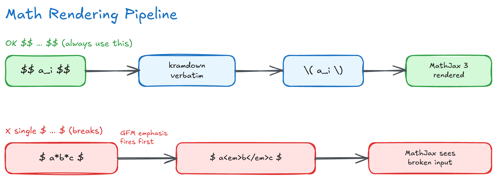

# 기술 문서 — 내부 구조와 아키텍처

이 블로그가 어떻게 빌드되고 맞물려 돌아가는지를 설명하는 문서다. 글을 읽는 독자가 아니라
**템플릿을 고치거나 빌드를 디버깅하는 사람**을 위한 것이다. 프론트엔드 경험이 많지 않아도
따라올 수 있도록, 각 절은 "이게 무엇이고 왜 이렇게 했는지"부터 풀어 쓴다.

다루는 순서는 렌더링 파이프라인 → URL·내비게이션을 결정하는 분류 체계 → 수식 처리(와 그 함정)
→ 검색 → 스타일 → 배포다.

처음 읽는다면 §0(개념 빠르게 잡기)과 §1(기술 스택)으로 큰 그림을 잡고, 무언가 고장 났다면
§8(함정 모음)부터 보면 빠르다. 설치와 글 작성 방법은 [README.ko.md](../README.ko.md)에 있다.

---

## 0. 먼저 잡고 가는 핵심 개념

프론트엔드/Jekyll이 익숙하지 않다면 아래 용어만 먼저 이해하면 나머지가 술술 읽힌다.

- **정적 사이트(static site)** — 사용자가 페이지를 열 때마다 서버가 계산해서 만들어 주는
  게 아니라, **미리 다 만들어 둔 HTML 파일**을 그대로 내려주는 사이트다. 데이터베이스도,
  서버 코드도 없다. 그래서 빠르고 싸고(거의 무료 호스팅), 해킹당할 표면이 작다. 대신 글을
  올릴 때마다 **빌드(build)** 라는 "HTML 미리 굽기" 과정을 한 번 거쳐야 한다.
- **정적 사이트 생성기(SSG, Static Site Generator)** — 그 "굽기"를 해 주는 도구. 여기서는
  **Jekyll**을 쓴다. 마크다운으로 쓴 글(`.md`)과 템플릿을 받아 완성된 HTML 폴더(`_site/`)를
  만들어 낸다.
- **마크다운(Markdown)** — `# 제목`, `**굵게**` 처럼 기호 몇 개로 서식을 표현하는 가벼운
  문법. 글쓴이는 마크다운만 쓰면 되고, 변환은 빌드가 알아서 한다.
- **프런트매터(front matter)** — 각 `.md` 파일 맨 위에 `---`로 감싸 적는 YAML 메타데이터
  (제목·날짜·카테고리 등). 글의 "설정값"이라고 보면 된다. 이 값들이 URL과 화면 표시를
  모두 좌우한다.
- **Liquid** — Jekyll의 템플릿 언어. HTML 안에 ``(로직: 반복·조건)와
  `{{ ... }}`(값 출력)를 끼워 넣어, 글 데이터로 페이지를 찍어내게 해 준다. "HTML용
  치환 틀"이라고 생각하면 된다.
- **레이아웃(layout)과 인클루드(include)** — 레이아웃은 페이지의 큰 틀(`_layouts/`),
  인클루드는 머리글·바닥글처럼 여러 페이지가 공유하는 작은 조각(`_includes/`)이다.
  같은 코드를 반복하지 않으려고 나눠 둔 것이다.
- **Sass/SCSS** — CSS를 변수·중첩·임포트 같은 기능으로 더 편하게 쓰게 해 주는 확장 문법.
  `.scss` 파일을 빌드가 평범한 `.css`로 컴파일한다(`_sass/`).
- **kramdown / Rouge / MathJax** — 각각 마크다운→HTML 변환기, 코드 색칠(신택스 하이라이팅)
  도구, 수식 렌더러다. 아래에서 다시 나온다.

한 문장 요약: **마크다운 글 + 템플릿 → (Jekyll 빌드) → `_site/`의 완성된 HTML → GitHub
Pages가 그대로 서빙.**

---

## 1. 기술 스택

각 줄은 "무엇을, 왜 골랐는가"다. 처음엔 이름만 훑고 넘어가도 된다.

| 영역 | 선택 | 한 줄 설명 |
|------|------|-----------|
| 정적 사이트 생성기 | Jekyll 4.4 (`Gemfile`, Ruby 3.3+), kramdown(GFM 입력) | 마크다운 글을 HTML로 굽는 본체. `Gemfile`은 Ruby의 의존성 목록(= `package.json`에 해당) |
| 플러그인(gem) | `jekyll-paginate`, `jekyll-sitemap`, `jekyll-feed`, `jekyll-redirect-from` | 각각 목록 페이지 나누기, `sitemap.xml`(검색엔진용 지도), `feed.xml`(RSS 구독) 자동 생성, 옛 URL 리디렉션 페이지 생성 |
| 로컬 플러그인(`_plugins/`) | `reading_time.rb`(한·영 읽기시간 계산), `lazy_images.rb`(``에 lazy-load 부여), `post_description.rb`(글의 검색 설명문 생성), `related_posts.rb`(공유 태그로 관련 글 선정 + 글 끝 이전/다음 링크), `scrollable_tables.rb`(넓은 표를 가로 스크롤 컨테이너로 감싸기), `search_index.rb`(검색 색인용 평문 변환), `legacy_urls.rb`(옛 글 URL을 리디렉션 대상으로 등록) | 우리가 직접 만든 Ruby 확장. 이것 때문에 GitHub Pages 기본 빌드 대신 Jekyll을 직접 돌린다(§1 아래 참고) |
| 신택스 하이라이팅 | Rouge(서버사이드, kramdown 내장) | 코드 블록에 색을 입히는 작업을 **빌드 때 미리** 한다(브라우저 부담 0). 색 테마는 `_sass/_syntax.scss` |
| 수식 | kramdown `math_engine: mathjax` → MathJax 3, 포스트별 `use_math`로 로드 | 수학 기호를 브라우저에서 예쁘게 그려 주는 라이브러리. 수식이 있는 글에서만 불러온다 |
| 스타일 | Sass(`_sass/`), 벤더링된 Bourbon + Neat 그리드 프레임워크 | "벤더링"은 외부 라이브러리를 저장소 안에 복사해 둔 것. `jekyll-sass-converter` 2.x(libsass)로 **고정** — 3.x(dart-sass)는 Bourbon/Neat의 구식 `/` 나눗셈 문법에서 에러 |
| 자바스크립트 | 바닐라 JS(`js/main.js`, jQuery 없음) | "바닐라"는 프레임워크 없이 순수 JS만 쓴다는 뜻. 이미지 확대는 GLightbox. 외부 CDN 스크립트는 **SRI**로 무결성 검증(아래 설명) |
| 검색 | `search.json`(전체 본문 색인) 위에 `simple-jekyll-search` | 서버 없이 브라우저에서 도는 검색. 미리 만들어 둔 색인 파일을 받아 클라이언트가 직접 찾는다 |
| 다크모드 | 라이트가 기본, 토글로 opt-in(`_sass/_dark.scss`, `[data-theme="dark"]`) | OS의 다크모드 설정은 **따르지 않고**, 사용자가 버튼을 눌러 켜야 한다. 테마에 따라 바뀌어야 하는 두 값이 CSS 밖에 있다 — `color-scheme`(스크롤바 등 브라우저 위젯)은 `_dark.scss`가 `data-theme`으로 처리하고, `theme-color`(모바일 주소창)는 메타 태그라 `head.html`의 인라인 스크립트와 `main.js`의 토글이 함께 갱신한다 |
| 호스팅/CI | GitHub Actions로 GitHub Pages 배포(`.github/workflows/jekyll.yml`) | `main`에 푸시하면 자동으로 빌드·검사·배포. 같은 검사가 `main`으로 향하는 PR에서도 돌아 머지 전에 막는다 |

> **용어 — CDN과 SRI.** *CDN*은 인기 라이브러리를 전 세계 서버에서 빠르게 내려주는 공용
> 배포망이다(예: cdnjs, jsDelivr). 문제는 그 외부 파일이 몰래 바뀌면 우리 사이트에
> 악성 코드가 섞일 수 있다는 것. *SRI(Subresource Integrity)* 는 `<script>`/`<link>`에
> `integrity="sha384-..."` 해시를 박아 두어, 받은 파일이 그 해시와 다르면 브라우저가
> **실행을 거부**하게 만든다. 그래서 외부에서 불러오는 것은 버전을 고정하고 SRI를 붙인다.

> **왜 GitHub Pages 기본 빌드가 아니라 Jekyll을 직접 돌리나?** GitHub Pages의 내장
> 빌드는 보안 샌드박스라 우리가 `_plugins/`에 만든 커스텀 플러그인을 막는다. 그래서 로컬과
> CI 모두 순수 `jekyll`을 직접 실행한다.

## 2. 빌드 파이프라인 — 마크다운 한 편이 HTML이 되기까지



글 하나(`_posts/2025-01-23-some-slug.md`)가 빌드를 거쳐 웹페이지가 되는 흐름이다.

1. **프런트매터 읽기** — 파일 맨 위 YAML(`categories`, `date`, `title` 등)을 먼저 읽는다.
   이 값들이 **출력 경로**(이 파일이 어떤 URL로 나갈지)와 **템플릿 변수**(화면에 뿌릴
   제목·날짜 등)를 모두 결정한다. 즉 글의 설정표 역할.
2. **마크다운 → HTML** — 본문을 kramdown이 HTML로 변환한다. 입력 방언은 GFM(GitHub
   Flavored Markdown)이다. 이 단계에서 Rouge가 코드 블록을 토큰별로 잘라 색을 입힌다.
3. **Liquid로 틀에 끼우기** — `_layouts/default.html`이 모든 페이지의 바깥 틀이다(`<head>`
   + 머리글 + 본문 자리 + 바닥글). 그 안의 본문 자리에 `post`/`page` 레이아웃이
   들어가 확장된다. 머리글·바닥글 같은 공통 조각은 `_includes/`에서 가져온다.

   ```
   default.html  (가장 바깥 틀: <html><head>…<body> 머리글 + {{ content }} + 바닥글)
     └─ post.html / page.html  (본문 영역을 채우는 레이아웃)
          └─ 실제 글 내용
   ```

4. **출력** — 완성된 HTML이 `_site/` 아래
   `<category>/<subcategory>/YYYY/MM/DD/<slug>.html` 경로로 기록된다(경로 규칙은 §3).

`_site/`는 **빌드 결과물**이라 git에서 제외된다(매번 새로 구워지므로 버전 관리할 이유가
없다). 로컬에 생기는 `_posts/_site/`, `.sass-cache/`, `.jekyll-cache/`도 스테일(오래된)
빌드 캐시이므로 무시되며, 지워도 안전하다(다음 빌드가 다시 만든다).

## 3. 분류 체계 → URL과 내비게이션

이 블로그에서 가장 헷갈리기 쉬운 부분이다. 핵심은 **카테고리가 곧 URL이고, 동시에 내비게이션
탭을 결정한다**는 것.

포스트는 프런트매터에 **2단계** 카테고리를 가진다: `categories: ["<유형>", "<주제>"]`.

- **0단계 (유형)** — `Paper Reviews`, `Paper Summaries`, `Tech Guides`, `Insights` 중 하나.
  글이 어느 내비 탭에 들어갈지를 정한다. 넷 다 전용 페이지와 탭을 가지며, 글이 없는 유형은
  빈 상태 문구를 띄운다(아래 "내비게이션은 코드가 아니라 데이터가 만든다" 참조).
- **1단계 (주제)** — `Language-Models`, `Multimodal-Learning`, `Finetuning`,
  `Retrieval-Augmented-Generation`, `Agentic-AI`, `Data-Architecture` 등. 세부 주제이며
  필요하면 자유롭게 추가한다.

이 둘과 **날짜**가 합쳐져 출력 경로(=URL)가 된다:



```
categories: ["Paper Reviews", "Language-Models"]  +  date: 2025-01-23
        ↓
_site/paper-reviews/language-models/2025/01/23/<slug>.html
```

경로 규칙은 `_config.yml`의 `permalink`(`:slugified_categories`)다. 카테고리를 소문자로 바꾸고
공백을 `-`로 바꾸므로, 앵커에 쓰는 `slugify`와 결과가 같다.

그래서 **이미 게시된 글의 카테고리나 날짜를 바꾸면 URL이 바뀐다** — 외부에서 걸린 링크와
검색 색인이 깨지므로 함부로 고치지 않는다(§9의 "날짜 드리프트" 참조).

> **옛 URL 리디렉션.** 예전 규칙(`:categories`)은 공백을 그대로 둬 `Paper Reviews` 글이
> `/paper%20reviews/…`로 게시됐다. `_plugins/legacy_urls.rb`가 옛 규칙으로 계산한 경로가 지금
> URL과 다르면 그 경로를 글의 `redirect_from`에 넣고, `jekyll-redirect-from`이 그 자리에 새
> URL로 보내는 페이지(즉시 meta refresh, 새 URL을 canonical로 지정)를 만든다. GitHub Pages는
> 301을 보낼 수 없어서 쓰는 방식이며, Google은 이를 영구 이동으로 처리한다.
> `validate-site.sh`가 모든 리디렉션의 목적지가 빌드에 있는지와 사이트맵에 공백 URL이 없는지를
> 검사한다.

### 내비게이션은 코드가 아니라 데이터가 만든다

상단 메뉴는 하드코딩이 아니다. `_includes/nav_links.html`이 **프런트매터에 `main_nav: true`가
달린 모든 페이지**를 찾아 `nav_order` 숫자 순으로 자동 나열한다. 새 탭을 넣고 싶으면 페이지
프런트매터에 두 값을 더하면 된다. 현재 순서:

| nav_order | 페이지 | 소스 |
|-----------|--------|------|
| 1 | About | `about.md` |
| 2 | Paper Summaries | `paper-summaries.md` — `site.categories['Paper Summaries']` 필터 |
| 3 | Paper Reviews | `paper-reviews.md` — `site.categories['Paper Reviews']` 필터, 주제별 그룹화 |
| 4 | Tech Guides | `tech-guides.md` — `site.categories['Tech Guides']` 필터 |
| 5 | Insights | `insights.md` — `site.categories['Insights']` 필터 |
| 6 | Search | `search.md` |

**빈 섹션도 탭을 유지한다.** 글이 없는 유형은 `_includes/category-posts.html`의 `empty`
문구를 띄운다("Summaries are in the works…"). 편수가 0이라고 `main_nav`를 떼지 않는다 —
탭이 사라지면 채우는 중인 섹션이 아니라 **없어진 섹션**으로 읽히고, 남은 탭이 로고 옆에
좁게 뭉쳐 전체 폭 히어로와 어긋난다. 빈 상태 문구가 정직한 신호이고, 탭 자체가 "이 블로그는
이 종류의 글도 쓴다"는 선언이다.

`categories.html`(`/categories/`)과 `tags.html`(`/tags/`)은 *모든* 카테고리/태그를 가로지르는
전체 색인 페이지다. 메인 내비에는 없고, 각 포스트 하단의 메타데이터에서 링크된다.

> **함정 — 카테고리 "누수".** Liquid의 `site.categories`는 그 이름이 달린 글을 **유형
> 구분 없이** 전부 모은다. 그래서 *모든* 카테고리를 순회하는 페이지를 만들면, 다른 유형의
> 글이 같은 1단계 주제를 공유할 때 엉뚱하게 딸려 온다(예: 1단계 주제가 `Agentic-AI`인
> `Insights` 글이 Paper Reviews 목록에 노출). 유형 페이지들은 이를 막으려고 **반드시
> `site.categories['<유형>']`으로 먼저 거른 뒤** 주제별로 그룹화한다 — 절대 반대 순서로
> 하지 않는다.

> **함정 — 앵커 점프 깨짐.** 카테고리·태그 앵커는 **링크 쪽과 헤딩 `id` 쪽이 같은 방식으로
> 슬러그를 만들어야** 한다. 양쪽 다 `slugify` 필터를 쓴다. 한쪽만 `downcase`거나 원본
> 케이스(`id="{{cat}}"`)를 내면 클릭해도 해당 위치로 점프하지 않는다. 새 목록 페이지를 만들 땐
> `| slugify`를 빼먹지 않는다.
>
> 이 어긋남은 **아무 링크도 그 앵커를 가리키지 않으면 html-proofer가 잡지 못한다.** 목록
> 페이지가 자기 헤딩으로 들어오는 링크를 갖고 있지 않은 경우가 그렇다.

### 태그: 세부 태그 + 통제된 주제 태그

태그는 자유 형식이지만 **두 층**으로 쓴다.

- **세부 태그** — 논문 하나의 기여를 서술한다(`Fine-Grained-Expert-Segmentation`,
  `Dependency-Aware-Tree-Traversal`). 논문 색인으로는 정확하다.
- **주제 태그** — 글을 서로 잇는다. `Agentic-AI`, `Alignment`, `DeepSeek`,
  `Knowledge-Graph`, `Llama`, `Mixture-of-Experts`, `Multimodal-Models`,
  `Reasoning-Models`, `Retrieval-Augmented-Generation`.

**세부 태그만 달면 관련 글이 안 붙는다.** 논문 하나의 기여를 그대로 옮긴 태그는 그 논문에만
붙을 수 있고, `related_posts.rb`는 공유 태그를 요구한다. 그래서 세부 태그만 달린 글은
"Related reading" 없이 배포된다. 한 주제를 여러 이름으로 부르는 것도 같은 증상을 만든다
(`Agentic-Architecture`/`Agentic-Patterns`/`Agentic-Infrastructure`가 그랬다).

관련 글이 비어 보일 때 고칠 지점은 `related_posts.rb`의 규칙이 아니라 **글의 프런트매터**다.
규칙을 느슨하게 풀어 카테고리만으로 연결하면, "둘 다 Paper Reviews / Language-Models"라는
이유로 공통점 없는 글이 서로 추천된다. 가중치가 그걸 막는 구조는 플러그인 상단 주석
(`TAG_WEIGHT`·`SUBCATEGORY_WEIGHT`·`CATEGORY_WEIGHT`)에 설명돼 있다.

그리고 세부 태그는 지우지 않는다 — 살아 있는 `/tags/` 앵커가 움직인다. 주제 태그를
**얹기만** 한다.

## 4. 수식 렌더링

**수식은 항상 `$$...$$`로 작성한다** — 인라인이든 디스플레이든 예외 없이. 이유를 알면 헷갈리지
않는다.



배경: kramdown에서 수식을 감싸는 **유일한** 구분자가 `$$`다. `$$`로 감싸면 kramdown이 그
안의 내용을 **건드리지 않고 그대로 보존**해 `\(...\)`(인라인) 또는 `\[...\]`(디스플레이)로
HTML에 내보낸다. 그러면 브라우저에서 MathJax 3(`_includes/head.html`에 설정)가 그것을
받아 실제 수식으로 그린다.

### 단일 `$`가 깨지는 이유 (꼭 알아야 함)

kramdown은 단일 `$`를 수식으로 **취급하지 않는다**. `$x_i + y_j$`는 그냥 일반 텍스트로 본다.
문제는 마크다운 강조 문법(`_..._` → 기울임, `*...*` → 굵게)이 수식 처리보다 **먼저** 돈다는
점이다. 그래서 `$` 안에 짝지어진 `_`나 `*`가 있으면 그게 `<em>`/`<strong>` 태그로 바뀌어,
MathJax에는 이미 망가진 입력이 전달된다(위 그림의 빨간 경로). 예를 들어 `$a*b*c$`가
`$a<em>b</em>c$`가 되어버린다.

언더스코어를 `\_`로 하나하나 이스케이프해도 증상은 사라지지만, 그건 우회책이다. 해결은
**`$$`를 쓰는 것** — 구간 안의 마크다운 처리를 통째로 끈다. 참고로 코드 블록 *안*의 단일
`$`는 verbatim(있는 그대로) 코드로 표시되므로 이 문제와 무관하다.

> **통화 표기 주의.** 본문에 쓰는 달러 기호(`$1.2B`, `$250M`)는 수식이 아니므로 단일 `$`로
> 둬야 한다. 그래서 MathJax 설정에서 `$`를 인라인 구분자에서 **일부러 뺐다**(`\(...\)`만
> 인식). 그러지 않으면 한 줄에 통화 `$`가 둘 있을 때 MathJax가 그 사이를 수식으로 잘못
> 렌더링한다. `processEscapes: true` 설정 덕에 정말로 달러 기호를 수식 안에 쓰고 싶을 땐
> `\$`로 출력할 수 있다.

MathJax 설정은 `head.html`에 있고 ``로 감싸 **프런트매터에
`use_math: true`가 켜진 포스트에서만** 로드한다. 덕분에 수식 없는 산문 글과 일반 페이지는
약 1 MB짜리 MathJax 스크립트를 아예 내려받지 않아 가볍다.

> **커스텀 매크로.** `head.html`의 MathJax `macros`에 `\llbracket`/`\rrbracket`(⟦ ⟧),
> `\textsc`, 그리고 `|`(→ `\vert`)가 정의돼 있다. 이 매크로를 본문에서 쓰려면 반드시 여기에
> 먼저 등록돼 있어야 한다.

## 5. 검색 — 서버 없이 브라우저에서 도는 방식

이 사이트는 백엔드 서버가 없으므로, 검색도 **미리 만들어 둔 색인 파일을 브라우저가 받아
직접 뒤지는** 방식이다.

- **`search.json`** 은 Liquid 템플릿(`layout: null`, 즉 HTML 틀 없이 순수 JSON만 출력)으로,
  빌드 때 모든 포스트를 `{title, url, date, category, tags, content}` 형태로 뽑아낸다.
  `content`는 **평문으로 만든 본문 전체**이며, 매칭과 표시에 모두 이것 하나만 쓴다.
- **`plain_text` 필터**(`_plugins/search_index.rb`)가 렌더된 HTML을 평문으로 바꾼다.
  `strip_html | strip_newlines`를 대신하는데, 그쪽이 두 가지를 놓쳤다.
  - **엔티티를 그대로 뒀다.** kramdown은 본문의 `>`를 `&gt;`로 escape하므로, 색인에
    `"음료 &gt; 탄산음료"`가 들어가 검색 결과에 그대로 찍혔다.
  - **블록 경계에 아무것도 남기지 않았다.** `<p>끝</p><p>시작</p>`이 `끝시작`이라는 한
    덩어리로 색인돼 두 단어 어느 쪽으로도 검색되지 않았다.

  순서가 중요하다 — **태그를 먼저 지우고 그다음에 엔티티를 디코딩한다.** 반대로 하면 마크업을
  인용한 글의 `&lt;script&gt;`가 진짜 태그가 되고, 이어지는 태그 제거가 저자가 쓴 글자를
  지운다. 인라인 태그(`<em>`, `<code>`)는 공백 없이 벗겨 `<em>강조</em>된`이 한 단어로 남는다.

  같은 필터가 **수식 구분자도 벗긴다.** kramdown의 mathjax 엔진은 `\(...\)` · `\[...\]`를
  HTML에 글자 그대로 남기므로, 평문화한 본문이 `메커니즘의 \(O(L^2)\) 계산 복잡도`가 되고
  발췌가 그 구간에 걸리면 구분자가 독자에게 보였다. 구분자만 지우고 **안의 TeX는 남긴다** —
  문장이 말하는 대상이고, 수식 속 기호도 계속 검색돼야 한다. 인라인 수식에는 공백을 붙이지
  않는다(한국어는 조사가 기호에 바로 붙어 `\(\theta\)로`가 한 단어여야 한다). 디스플레이
  수식은 원래 블록이라 붙여도 된다. `test/test_search_index.rb`가 이 경계들을 고정한다.
- **왜 발췌가 아니라 전체 본문을 색인하나** — `simple-jekyll-search`는 형태소 분석 없이
  단순 부분문자열 매칭을 한다. **색인에 없는 글자는 못 찾는다.** 발췌만 색인하면 본문
  중·후반에만 나오는 단어("어텐션", "트랜스포머" 같은)는 검색 결과가 0건이 된다. `content`로
  전체를 색인하는 건 한글 재현율을 위한 의도된 선택이다.
  대가는 파일 크기다 — 본문 전체가 들어가므로 **글 수에 비례해 선형으로 커진다**(현재 규모는
  MB 단위, gzip 후 그 3분의 1 아래). `/search/`에서만 내려받으므로 다른 페이지 속도엔 영향이
  없다. 실제 값은 `curl -so /dev/null -w '%{size_download}' <url>/search.json`로 확인한다.

- **`js/search.js`** 가 `simple-jekyll-search`(CDN 버전 **고정 + SRI**: `1.10.0`)를
  `search.md`의 `#search-input` 입력칸에 연결한다.
- **발췌는 매치 위치를 중심으로 자른다.** 이게 검색 결과의 핵심이다. 색인은 본문 전체인데
  카드에 고정된 앞부분을 보여 주면, 검색어는 거의 항상 그 밖에 있다 — 한국어 질의는 매치가
  본문 300자 이후에만 있는 경우가 대다수여서, **맞는 결과가 강조 하나 없는 엉뚱한 결과처럼
  보였다.** 그래서 `templateMiddleware`(라이브러리 훅. 결과마다 `{필드}` 하나당 한 번 호출되며
  필드 값 전체를 받아 렌더할 문자열을 돌려준다)에서 매치 주변 창을 잘라낸다. 본문 전체는 JS까지
  오고 창만 DOM에 들어간다.
  - 질의가 두 단어 이상이면 매치마다 창을 만들어 보고 **서로 다른 단어를 가장 많이 담는 창**을
    고른다. 첫 매치만 쓰면 "vibe coding"에서 멀리 떨어진 `coding` 하나만 걸려 반쪽짜리
    발췌가 나온다.
  - 단어 중간에서 자르지 않으려 공백을 찾지만 **12자 안에서만** 찾는다. 한국어는 어절 사이
    공백이 없어 무제한으로 찾으면 매치를 지나쳐 창을 삼킨다. 상한이 있으면 글자 단위 절단으로
    자연스럽게 내려앉는다.
  - 미들웨어가 돌려주는 값은 라이브러리가 **HTML로 삽입**하므로, 이 파일이 직접 escape하고
    `<mark>`만 스스로 넣는다.
- **결과 개수는 상한에 닿으면 총계를 말하지 않는다.** 라이브러리는 `limit`개를 찾으면 스캔을
  멈추므로 진짜 총계를 모른다. 그래서 상한에 닿으면 "Showing the first 10 matches."로
  적는다 — "10 posts found."는 셈이 아니라 추측이다.
- `category`/`tags`도 색인에 들어가므로 제목·본문뿐 아니라 메타데이터로도 검색된다.
  색인에는 **글(`site.posts`)만** 들어간다 — `search.json`이 `site.posts`를 순회하므로
  About·Search·index 같은 페이지는 애초에 후보가 아니다.

  > **주의 — `_config.yml`로는 검색을 제어할 수 없다.** `simple-jekyll-search`는 브라우저에서
  > 도는 JS라 `_config.yml`을 읽지 못한다. 색인 대상을 바꾸려면 `search.json`의 Liquid를
  > 고쳐야 한다. `_config.yml`에 `simple_jekyll_search:` 같은 블록을 만들어도 아무 일도
  > 일어나지 않는다.

## 6. 스타일 (Sass)

`css/main.scss`가 Sass의 진입점이다. 빌드 때 이 한 파일이 아래 순서대로 다른 조각들을
임포트해 하나의 `main.css`로 합쳐진다(**순서가 중요**하다 — CSS는 뒤에 온 규칙이 이기는
"캐스케이드"라서):

```
Bourbon → base/ → Neat → _layout → _post → _tags → _syntax(Rouge 코드 테마)
        → _dark(다크모드 오버라이드 — 맨 마지막에 로드해 우선권 확보)
```

- **수정해도 되는 곳**: `_sass/_layout.scss`, `_sass/_post.scss`, `_sass/_tags.scss`,
  `_sass/base/*`(특히 색·간격·브레이크포인트를 모아 둔 `_variables.scss`).
- **수정하면 안 되는 곳**: `_sass/bourbon/**`, `_sass/neat/**` — 외부에서 가져온 벤더
  프레임워크다.
- **`_sass/_syntax.scss`는 재생성하지 말 것**: 원래 `rougify style monokai.sublime`의
  출력이지만 **그 뒤 손으로 고쳤다.** Monokai 기본 팔레트의 주석·키워드 색이 코드 배경에서
  명도 대비 4.5:1을 못 넘겨 두 색을 올려 놨고, 파일 맨 위 주석에 원래 값과 대비 수치가
  적혀 있다. `rougify`로 덮어쓰면 그 수정이 조용히 사라진다. 색을 바꿔야 하면 이 파일을
  직접 고치고 주석도 함께 갱신한다.
- **디자인 토큰을 쓸 것**: 값을 하드코딩하지 말고 미리 정의된 변수를 쓴다. 전환은
  `$transition-*`, 그림자는 `$shadow-*`, 강조색/보조 텍스트는 `$action-color`/`$medium-gray`.
  `0.3s ease`나 `#aaaaaa` 같은 리터럴을 직접 박지 않는다. (예: `$medium-gray`는
  `#767676` — 흰 배경에서 WCAG AA 명도 대비를 통과하는 값. `$highlight-color`는 흰 글자가
  읽히는 진한 파랑으로 헤더/푸터 배경용.)
- **절대 금지**: HTML 안의 인라인 `<style>` 블록에 SCSS 변수(`$base-spacing` 등)를 쓰지
  말 것. Jekyll은 HTML 안의 `<style>`에서는 Sass를 컴파일하지 않으므로, `$base-spacing`이
  치환되지 않고 **리터럴 문자열 그대로** 깨진 CSS로 나간다. 페이지 전용 스타일도 `_sass/`
  파셜에 두고 `main.scss`에서 임포트한다.

> **용어 — 디자인 토큰.** 색·간격·그림자 같은 값을 이름 붙은 변수로 한곳에 모아 둔 것.
> 나중에 톤을 바꿀 때 변수 한 줄만 고치면 전체에 반영되므로, 같은 값을 여기저기 하드코딩하지
> 않는다.

접근성 기준(`_layout.scss`): 키보드로 이동할 때 포커스가 보이도록 상호작용 요소에
`:focus-visible` 아웃라인을 주고, 움직임에 민감한 사용자를 위해 호버 시 확대/이동 효과를
무력화하는 `prefers-reduced-motion` 블록을 둔다. 모바일 메뉴 버튼은 스크린리더용
`aria-label`/`aria-expanded`/`aria-controls`를 갖고, JS가 열림/닫힘 상태에 맞춰
`aria-expanded`를 동기화한다. 현재 보고 있는 내비 링크는 `aria-current="page"`를 받는다.

## 7. 배포 및 SEO

- **CI(자동 배포)** — `.github/workflows/jekyll.yml`이 `main` 브랜치에 푸시될 때마다
  `JEKYLL_ENV=production`으로 빌드하고 `actions/deploy-pages`로 GitHub Pages에 올린다.
  빌드 직후 **html-proofer**가 내부 링크·이미지·앵커가 다 살아 있는지 검사하고, 하나라도
  깨졌으면 **배포를 막는다**(외부 링크는 느리고 불안정해 건너뛴다). 푸시 전에 README의
  "Validate before pushing" 명령으로 같은 검사를 로컬에서 돌리면 배포 실패를 예방할 수 있다.

  권한은 잡별로 나눈다. 워크플로 기본값은 `contents: read`이고, Pages 쓰기와 OIDC 토큰은
  `deploy` 잡에만 준다. 동시 실행 그룹은 ref별이라 PR 실행이 대기 중인 배포를 밀어내지 않고,
  같은 PR의 이전 실행은 새 커밋이 오면 취소된다.

  같은 워크플로가 **`main`으로 향하는 PR에서도** 돈다(`deploy` 잡과 아티팩트 업로드만
  `github.event_name != 'pull_request'`로 건너뛴다). 그래서 게이트가 머지를 **막는다.** PR
  트리거가 없으면 검사는 머지 뒤에야 돌고, 잘못된 변경은 main에 착지한 다음 배포에 실패한다 —
  사이트는 마지막 정상 배포를 계속 서빙하지만 main이 빨간 상태로 남는다.

  > **용어 — CI.** Continuous Integration. 코드를 올리면 정해 둔 검사·빌드·배포를 자동으로
  > 돌려주는 파이프라인이다. 여기서는 GitHub Actions가 그 역할을 한다.

- **사이트맵/피드** — `jekyll-sitemap`이 `/sitemap.xml`(검색엔진이 페이지 목록을 파악하는
  지도)을, `jekyll-feed`가 `/feed.xml`(RSS 구독용)을 자동 생성한다. 원본에 `robots.txt`가
  없으면 `jekyll-sitemap`이 `Sitemap:` 한 줄짜리 `robots.txt`를 만들어 크롤러를 사이트맵으로
  안내한다. 손으로 만든 `robots.txt`를 두면 그 생성이 꺼진다. `head.html`은
  `<link rel="alternate">`로 피드 위치를 알린다. 내용이 없는 `/search/`와 `404.html`은
  `sitemap: false`로 사이트맵에서 뺀다.
- **저자 표기** — 글의 저자는 항상 블로그 저자다. JSON-LD `author`는 `site.name`, 피드의
  `<author>`는 `site.author`를 쓴다. 논문을 낸 기관은 `author`가 아니라 `paper_author`에
  적고 화면에 "Paper by …"로만 표시한다 — jekyll-feed가 글의 `author`를 피드 저자로 쓰기
  때문이다.
- **검색 노출 검사** — `script/validate-site.sh`가 빌드된 사이트를 훑어 사이트맵·피드가
  파싱되는지, 페이지당 `h1`이 1개인지, 헤딩 레벨을 건너뛰지 않는지, 모든 페이지에 설명문과
  canonical이 있는지, 설명문·제목이 중복되지 않는지 등을 확인한다. **검사 목록의 정본은
  스크립트 자체다** — 각 검사 옆 주석에 그 검사가 왜 있는지가 적혀 있다. htmlproofer가 보지
  않는 영역을 메우는 게 목적이다. 인자로 빌드 경로를 받고, 없으면 `_site`를 본다.
- **플러그인 단위 테스트** — `test/`가 `_plugins/`의 순수 로직을 플러그인당 한 파일씩
  minitest로 검사한다. `ruby test/run_all.rb`로 돌리며 CI에서 빌드보다 먼저 실행된다.
  플러그인은 모든 페이지의 메타데이터를 만들기 때문에, 여기서 조용히 동작이 바뀌면 사이트
  전체 콘텐츠가 바뀐다.
- **소유권 인증 토큰 파일** — 루트의 `google*.html`, `naver*.html`은 Google Search
  Console / 네이버가 "이 사이트가 정말 네 것이냐"를 확인하는 인증 파일이다. 사이트 루트에서
  **그대로 서빙돼야** 인증이 유지되고 사이트맵 크롤링이 된다. 그래서 `_config.yml`의
  `exclude` 목록에 **넣으면 안 된다**. 다시 제외하면 검색 색인이 조용히 망가진다 — 증상은
  "구글이 사이트맵을 못 읽음"이다.

## 8. 함정 모음 (디버깅 전에 읽을 것)

이 저장소를 고치다 부딪히기 쉬운, 비직관적인 지점만 모았다. 증상 → 원인 → 해결 순서다.

- **다크모드에서 글자가 안 보임** — 다크 규칙은 `<html>`에 붙는데, `_typography.scss`의
  `body { color:#333 }`이 명시도(specificity)가 더 높아 이긴다. 그래서 다크 mixin에서
  `body`·헤딩 색을 **명시하지 않으면** 어두운 배경에 어두운 글자가 된다. → 다크 규칙에서
  글자색을 명시적으로 지정. (§6)
- **수식이 `<em>`으로 깨짐** — 단일 `$` 안의 `_`/`*`가 MathJax보다 먼저 강조 문법으로
  처리됨. → `$$`로 감싼다. (§4)
- **검색이 단어를 못 찾음** — `search.json`이 발췌만 색인하면 본문 뒷부분 단어가 0건이 됨.
  → 전체 본문(`content`)을 색인한다. (§5)
- **카테고리/태그 앵커 점프 실패** — 메타 링크와 H2 `id`의 슬러그 방식이 다름. → 양쪽 다
  `slugify`로 통일. (§3)
- **SCSS 변수가 깨진 CSS로 출력** — 인라인 `<style>`에 `$변수`를 쓰면 Jekyll이 Sass를 안
  돌려 리터럴로 나감. → `_sass/` 파셜에 작성. (§6)
- **Sass 빌드 실패** — `jekyll-sass-converter` 3.x(dart-sass)가 벤더 Bourbon/Neat의 구식
  `/` 나눗셈에서 에러. → 2.x(libsass)로 고정돼 있음(`Gemfile` 건드리지 말 것). (§1)
- **검색 색인이 조용히 망가짐** — `google*.html`/`naver*.html`을 `exclude`하면 소유권
  인증이 풀림. → `exclude`에 넣지 않는다. (§7)
- **다이어그램 폰트가 손글씨체가 아닌 일반체로 나옴** — Resvg(다이어그램 PNG 변환기)는
  Excalidraw의 woff2 `@font-face`를 못 읽는다. → `assets/images/render-diagrams.sh`가 SVG에서
  `@font-face`를 지우고 `font-family`를 Excalifont로 바꾼 뒤 시스템 폰트로 렌더한다. 그래서
  전체 Excalifont `.ttf`가 시스템에 설치돼 있어야 한다(설치 방법은 스크립트 머리 주석). 또한 Excalifont에 없는 글자(`→`,`✓`,`✗`)는
  라벨 전체를 기본 폰트로 fallback시키므로, 다이어그램 텍스트에서는 ASCII(`->` 등)로 바꾼다.

## 9. 알려진 이슈 / 백로그

- **날짜 드리프트** — 대부분 포스트의 파일명 날짜가 프런트매터 `date:`(보통 원 논문 날짜)와
  다르다. Jekyll은 URL과 정렬에 **프런트매터 날짜**를 쓰므로 파일명 날짜는 사실상 외형일
  뿐이다. 새 글을 추가할 때 둘을 일관되게 맞추는 게 좋다. (이미 게시된 글은 자동 수정하지
  않는다 — 날짜를 고치면 URL이 바뀌어 외부 링크와 SEO가 깨지기 때문.)
- **한글 검색 라이브러리의 한계** — `simple-jekyll-search`는 형태소 분석 없는 부분문자열
  매칭이라, 띄어쓰기로 쪼개진 한글 복합어의 부분 검색에는 약하다. 전체 본문 색인으로 재현율은
  확보했지만, 더 정교한 검색이 필요해지면 Lunr 등으로 교체를 검토한다.
- **검색 색인 크기** — 전체 본문 색인이라 `search.json`이 글 수에 비례해 커진다(§5).
  `/search/`에서만 로드되긴 하나, 계속 늘면 색인 분할이나 서버사이드 검색을 고려한다.
- **검색 결과에 관련도 순위가 없다** — `simple-jekyll-search`는 `site.posts` 순서로 훑다가
  `limit`개를 찾으면 멈춘다. 그래서 결과는 **최신순이고, 제목이 걸린 글이 본문에 한 번 스친
  글보다 위로 오지 않는다.** 상한 때문에 정렬 훅(`sortMiddleware`)만으로는 고칠 수 없다 —
  이미 잘려 나간 뒤에 정렬하기 때문이다. 제대로 하려면 매칭·정렬·자르기를 직접 들고 있어야
  하고, 그 시점에는 라이브러리를 걷어내는 게 맞다(현재 쓰는 기능은 페치·부분문자열 매칭·템플릿
  치환뿐이다).
- **발췌에 TeX 명령이 남는다** — 수식 구분자는 벗기지만 안의 TeX는 남기므로(§5), 발췌가
  수식에 걸리면 `\theta`처럼 명령어가 그대로 보인다. `O(L^2)`처럼 읽히는 경우가 대부분이라
  그대로 두었다. 유니코드로 바꾸려면 TeX→기호 매핑이 필요하고, 그건 색인이 감당할 범위를
  넘는다.
